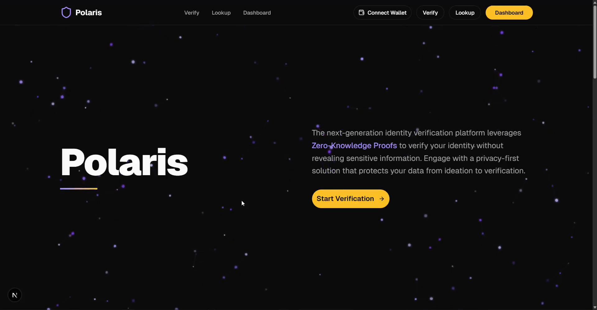
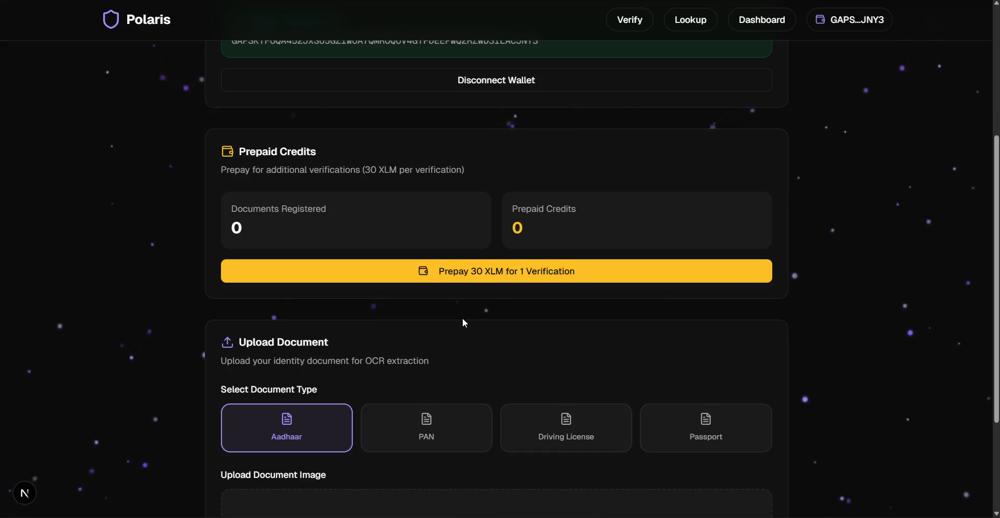
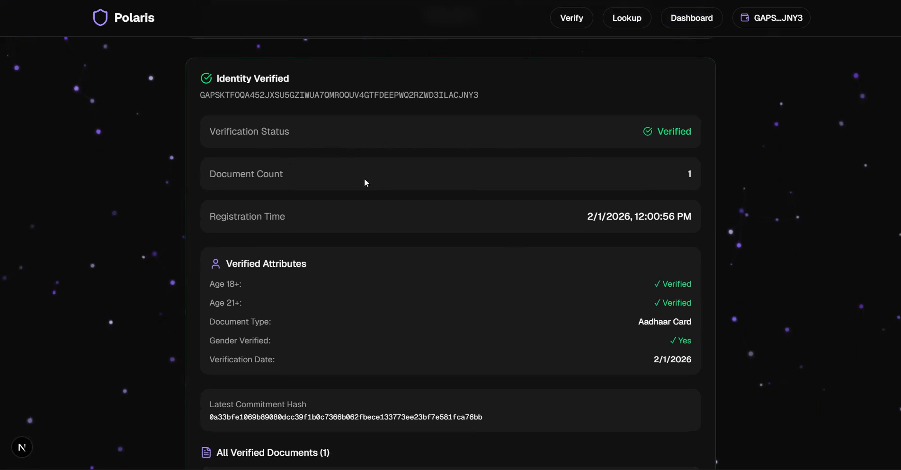

# 🌟 Polaris - ZK Identity Verification on Stellar

**Polaris** is a complete zero-knowledge identity verification system built on Stellar blockchain. It enables privacy-preserving identity verification using ZK-SNARKs (Groth16) for documents like Aadhaar, PAN, Driving License, and Passport.



## ✨ Features

- 🔐 **Zero-Knowledge Proofs** - Verify identity without revealing sensitive data
- 📄 **Multi-Document Support** - Aadhaar, PAN, DL, Passport
- 🎨 **Modern Frontend** - Next.js 16 with Tailwind CSS & Radix UI
- 🐍 **OCR Processing** - Python server with EasyOCR for document scanning
- ⚡ **Soroban Smart Contracts** - Deployed on Stellar testnet
- 🔗 **Freighter Wallet Integration** - Seamless Stellar wallet connection


---

## 📊 Quick Reference

### Project Structure
```
polaris/
├── circom/              # Circom compiler source
├── circuits/            # ZK circuits
│   ├── compiled/        # Built circuit files
│   ├── ptau/           # Powers of Tau
│   └── identity_verifier.circom
├── contracts/           # Soroban smart contracts
│   └── identity-verifier/
├── frontend/            # Next.js frontend
│   ├── app/            # App router pages
│   ├── components/     # UI components
│   └── lib/            # Utilities
├── python_server/       # OCR server
│   ├── app.py          # Flask application
│   └── requirements.txt
├── scripts/             # Automation scripts
│   ├── compile-circuit.sh
│   ├── deploy-contract.sh
│   ├── test.cjs
│   └── test-second-doc.cjs
├── server/              # Node.js backend
│   └── server.js
├── package.json         # Backend dependencies
└── .env                 # Configuration
```

### Key Commands

| Task | Command |
|------|---------|
| Compile Circuit | `./scripts/compile-circuit.sh` |
| Deploy Contract | `./scripts/deploy-contract.sh` |
| Start Backend | `npm start` |
| Start Python OCR | `python python_server/app.py` |
| Start Frontend | `cd frontend && npm run dev` |
| Test Flow | `node scripts/test.cjs` |
| Build Frontend | `cd frontend && npm run build` |

### Component Ports

| Component | Port | URL |
|-----------|------|-----|
| Backend API | 3000 | http://localhost:3000 |
| Frontend | 3001 | http://localhost:3001 |
| Python OCR | 5000 | http://localhost:5000 |

### Circuit Files

| File | Description | Size |
|------|-------------|------|
| `identity_verifier.circom` | Circuit source | ~5KB |
| `identity_verifier.r1cs` | Constraint system | ~200KB |
| `identity_verifier_final.zkey` | Proving key | ~5MB |
| `verification_key.json` | Verification key | ~1KB |

### Contract Functions

| Function | Description |
|----------|-------------|
| `initialize` | Initialize contract (once) |
| `register_verified_identity` | Register identity with ZK proof |
| `get_user_doc_count` | Get user's document count |
| `check_verification` | Check if user is verified |

---

## 🆘 Troubleshooting

| Issue | Solution |
|-------|----------|
| Circuit compilation fails | Check circom version >= 2.1.0, install circomlib |
| Contract deploy fails | Check Stellar CLI installed, account funded |
| Server won't start | Check .env has ADMIN_SECRET and CONTRACT_ID |
| Proof generation slow | Normal, takes 5-15 seconds for first proof |
| Transaction timeout | Check RPC_URL and network accessibility |
| Payment required error | Provide userSecret for 2nd+ documents |
| OCR extraction fails | Check image quality, supported document types |
| Frontend build errors | Run `npm install` in frontend directory |
| Python dependencies fail | Use Python 3.10+, create virtual environment |

### Common Error Messages

**"circom: command not found"**
```bash
cd circom && cargo install --path circom
```

**"stellar: command not found"**
```bash
cargo install --locked stellar-cli --features opt
```

**"No such file or directory: circuit_final.zkey"**
```bash
./scripts/compile-circuit.sh
```

**"Contract not initialized"**
```bash
node scripts/initialize-contract.cjs
```

**"EasyOCR models not found"**
- First run downloads models (~140MB automatically)
- Wait for download to complete

---

## ✅ Deployment Checklist

### Development
- [ ] Node.js v18+ installed
- [ ] Rust & Cargo installed
- [ ] Circom built from `circom/` directory
- [ ] snarkjs installed globally
- [ ] Stellar CLI installed
- [ ] Python 3.10+ installed
- [ ] Testnet account created & funded
- [ ] Root `npm install` completed
- [ ] Frontend `npm install` completed
- [ ] Python `pip install -r requirements.txt` completed
- [ ] `.env` file configured

### Circuit
- [ ] Circuit compiled (`circuit_final.zkey` exists)
- [ ] Verification key exported
- [ ] Circuit tested and validated

### Contract
- [ ] Contract built (WASM file exists)
- [ ] Contract deployed (CONTRACT_ID saved)
- [ ] Contract initialized
- [ ] `.env` updated with CONTRACT_ID

### Servers
- [ ] Backend server running (port 3000)
- [ ] Python OCR server running (port 5000)
- [ ] Frontend dev server running (port 3001)
- [ ] All health checks passing

### Testing
- [ ] First document test passed
- [ ] Second document test passed (payment)
- [ ] API endpoints tested
- [ ] OCR extraction tested
- [ ] Frontend UI tested

### Production
- [ ] Mainnet contract deployed
- [ ] PM2 configured
- [ ] Nginx reverse proxy configured
- [ ] SSL certificates installed
- [ ] Environment variables updated
- [ ] Monitoring enabled
- [ ] Backups configured

---

## 🎉 You're All Set!

Your **Polaris ZK Identity Verification System** is fully operational!

### What You've Built:
✅ Zero-knowledge proof circuits (Circom + Groth16)  
✅ Soroban smart contracts on Stellar  
✅ Node.js backend API  
✅ Python OCR server with EasyOCR  
✅ Modern Next.js frontend  
✅ Complete identity verification flow

### Next Steps:
1. 🧪 Test with real documents
2. 🎨 Customize frontend UI
3. 📈 Add analytics & monitoring
4. 🔐 Enhance security measures
5. 🚀 Deploy to production

---

## 📚 Additional Resources

- [Stellar Documentation](https://developers.stellar.org/)
- [Soroban Docs](https://soroban.stellar.org/docs)
- [Circom Documentation](https://docs.circom.io/)
- [snarkjs Guide](https://github.com/iden3/snarkjs)
- [Next.js Documentation](https://nextjs.org/docs)
- [EasyOCR Documentation](https://github.com/JaidedAI/EasyOCR)

---

## 🚀 Future Scope & Roadmap

### Phase 1: Core Enhancements (Q1 2026)

- [ ] **Multi-Country Support**
  - Add support for international documents (US SSN, UK Passport, EU ID)
  - Localization for multiple languages
  - Country-specific validation rules

- [ ] **Advanced ZK Features**
  - Range proofs (prove age is between 18-65 without exact DOB)
  - Selective disclosure (choose which attributes to reveal)
  - Recursive proofs for complex verifications

- [ ] **Mobile Applications**
  - React Native mobile app for iOS/Android
  - QR code scanning for in-person verification
  - Biometric authentication integration

### Phase 2: Enterprise Features (Q2 2026)

- [ ] **Business Integration**
  - REST API with API keys for enterprise clients
  - Webhooks for real-time verification notifications
  - Bulk verification endpoints
  - White-label solutions

- [ ] **Compliance & Auditing**
  - GDPR compliance tools
  - Audit trail and logging
  - Regulatory reporting dashboard
  - Third-party security audits

- [ ] **Advanced OCR**
  - Support for more document types (voter ID, health cards)
  - Video KYC (liveness detection)
  - Document authenticity verification (holograms, watermarks)

### Phase 3: Ecosystem Expansion (Q3 2026)

- [ ] **DeFi Integration**
  - Age-gated DeFi protocols (18+ only pools)
  - KYC-compliant DEX listings
  - Credit scoring based on verified identity

- [ ] **Cross-Chain Support**
  - Bridge to Ethereum, Polygon, Solana
  - Multi-chain identity portability
  - Universal identity standard

- [ ] **DAO Governance**
  - Community voting on verification criteria
  - Token-based governance model
  - Decentralized dispute resolution

### Phase 4: Advanced Features (Q4 2026)

- [ ] **Privacy Enhancements**
  - Zero-knowledge machine learning models
  - Homomorphic encryption for data processing
  - Anonymous credentials (Idemix, U-Prove)

- [ ] **Decentralized Storage**
  - IPFS integration for encrypted document storage
  - Filecoin for long-term archival
  - User-controlled data vaults

- [ ] **AI/ML Integration**
  - Fraud detection using ML models
  - Risk scoring and anomaly detection
  - Automated document classification

### Long-Term Vision (2027+)

- [ ] **Global Identity Network**
  - Interoperable identity verification across platforms
  - Universal reputation system
  - Decentralized identity standard (W3C DID)

- [ ] **Social Impact**
  - Financial inclusion for unbanked populations
  - Portable identity for refugees
  - Digital citizenship solutions

- [ ] **Research & Innovation**
  - Quantum-resistant cryptography
  - New ZK-SNARK schemes (PLONK, STARKs)
  - Academic partnerships and publications

---

## 🤝 Contributing

We welcome contributions! Please see [CONTRIBUTING.md](CONTRIBUTING.md) for guidelines.

### How to Contribute

1. Fork the repository
2. Create a feature branch (`git checkout -b feature/amazing-feature`)
3. Commit your changes (`git commit -m 'Add amazing feature'`)
4. Push to the branch (`git push origin feature/amazing-feature`)
5. Open a Pull Request

### Development Areas

- 🔐 Zero-knowledge circuit optimization
- 🎨 Frontend UI/UX improvements
- 🐍 OCR accuracy enhancements
- 📱 Mobile app development
- 📚 Documentation and tutorials
- 🧪 Testing and quality assurance

---

## 📄 License

This project is licensed under the MIT License - see the [LICENSE](LICENSE) file for details.

---

## 🙏 Acknowledgments

- **Stellar Development Foundation** - For Soroban smart contract platform
- **iden3** - For Circom and snarkjs ZK-SNARK tools
- **Hermez Network** - For Powers of Tau ceremony files
- **EasyOCR Community** - For open-source OCR capabilities
- **Vercel** - For Next.js framework and hosting

---

## � Future Scope & Roadmap

### Phase 1: Core Enhancements (Q1 2026)

- [ ] **Multi-Country Support**
  - Add support for international documents (US SSN, UK Passport, EU ID)
  - Localization for multiple languages
  - Country-specific validation rules

- [ ] **Advanced ZK Features**
  - Range proofs (prove age is between 18-65 without exact DOB)
  - Selective disclosure (choose which attributes to reveal)
  - Recursive proofs for complex verifications

- [ ] **Mobile Applications**
  - React Native mobile app for iOS/Android
  - QR code scanning for in-person verification
  - Biometric authentication integration

### Phase 2: Enterprise Features (Q2 2026)

- [ ] **Business Integration**
  - REST API with API keys for enterprise clients
  - Webhooks for real-time verification notifications
  - Bulk verification endpoints
  - White-label solutions

- [ ] **Compliance & Auditing**
  - GDPR compliance tools
  - Audit trail and logging
  - Regulatory reporting dashboard
  - Third-party security audits

- [ ] **Advanced OCR**
  - Support for more document types (voter ID, health cards)
  - Video KYC (liveness detection)
  - Document authenticity verification (holograms, watermarks)

### Phase 3: Ecosystem Expansion (Q3 2026)

- [ ] **DeFi Integration**
  - Age-gated DeFi protocols (18+ only pools)
  - KYC-compliant DEX listings
  - Credit scoring based on verified identity

- [ ] **Cross-Chain Support**
  - Bridge to Ethereum, Polygon, Solana
  - Multi-chain identity portability
  - Universal identity standard

- [ ] **DAO Governance**
  - Community voting on verification criteria
  - Token-based governance model
  - Decentralized dispute resolution

### Phase 4: Advanced Features (Q4 2026)

- [ ] **Privacy Enhancements**
  - Zero-knowledge machine learning models
  - Homomorphic encryption for data processing
  - Anonymous credentials (Idemix, U-Prove)

- [ ] **Decentralized Storage**
  - IPFS integration for encrypted document storage
  - Filecoin for long-term archival
  - User-controlled data vaults

- [ ] **AI/ML Integration**
  - Fraud detection using ML models
  - Risk scoring and anomaly detection
  - Automated document classification

### Long-Term Vision (2027+)

- [ ] **Global Identity Network**
  - Interoperable identity verification across platforms
  - Universal reputation system
  - Decentralized identity standard (W3C DID)

- [ ] **Social Impact**
  - Financial inclusion for unbanked populations
  - Portable identity for refugees
  - Digital citizenship solutions

- [ ] **Research & Innovation**
  - Quantum-resistant cryptography
  - New ZK-SNARK schemes (PLONK, STARKs)
  - Academic partnerships and publications

---

## 🤝 Contributing

We welcome contributions! Please see [CONTRIBUTING.md](CONTRIBUTING.md) for guidelines.

### How to Contribute

1. Fork the repository
2. Create a feature branch (`git checkout -b feature/amazing-feature`)
3. Commit your changes (`git commit -m 'Add amazing feature'`)
4. Push to the branch (`git push origin feature/amazing-feature`)
5. Open a Pull Request

### Development Areas

- 🔐 Zero-knowledge circuit optimization
- 🎨 Frontend UI/UX improvements
- 🐍 OCR accuracy enhancements
- 📱 Mobile app development
- 📚 Documentation and tutorials
- 🧪 Testing and quality assurance

---

## 📄 License

This project is licensed under the MIT License - see the [LICENSE](LICENSE) file for details.

---

## 🙏 Acknowledgments

- **Stellar Development Foundation** - For Soroban smart contract platform
- **iden3** - For Circom and snarkjs ZK-SNARK tools
- **Hermez Network** - For Powers of Tau ceremony files
- **EasyOCR Community** - For open-source OCR capabilities
- **Vercel** - For Next.js framework and hosting

---

## �📞 Contact & Support

- **GitHub Issues:** [Report bugs or request features](https://github.com/yourusername/polaris/issues)
- **Discord:** [Join our community](https://discord.gg/polaris) (Coming Soon)
- **Twitter:** [@PolarisZK](https://twitter.com/polariszk) (Coming Soon)
- **Email:** support@polaris.dev (Coming Soon)

---

<div align="center">

**Built with ❤️ using ZK-SNARKs on Stellar**

⭐ Star us on GitHub if you find this project useful!

[Documentation](docs/) • [API Reference](docs/API.md) • [Tutorials](docs/tutorials/)

</div>


---

## 📋 Table of Contents

1. [Prerequisites Installation](#1-prerequisites-installation)
2. [Project Setup](#2-project-setup)
3. [Circuit Compilation](#3-circuit-compilation)
4. [Contract Building & Deployment](#4-contract-building--deployment)
5. [Contract Initialization](#5-contract-initialization)
6. [Server Setup & Running](#6-server-setup--running)
7. [Python OCR Server](#7-python-ocr-server)
8. [Frontend Development](#8-frontend-development)
9. [Testing the Flow](#9-testing-the-flow)
10. [Production Deployment](#10-production-deployment)

---

## 1. Prerequisites Installation

### 1.1 Install Node.js (v18+)
```bash
# Check current version
node --version

# If not installed or < v18:
curl -fsSL https://deb.nodesource.com/setup_18.x | sudo -E bash -
sudo apt-get install -y nodejs
```

### 1.2 Install Rust & Cargo
```bash
curl --proto '=https' --tlsv1.2 -sSf https://sh.rustup.rs | sh
source $HOME/.cargo/env

# Add WASM targets
rustup target add wasm32-unknown-unknown

# Verify installation
rustc --version
cargo --version
```

### 1.3 Install Circom (Using Built-in Submodule)
```bash
cd /home/shiv/Codes/blockchain/polaris/circom

# Build circom from source
cargo build --release
cargo install --path circom

# Verify installation
circom --version  # Should show v2.1.x or higher
```

### 1.4 Install snarkjs
```bash
npm install -g snarkjs

# Verify installation
snarkjs --version  # Should show 0.7.x or higher
```

### 1.5 Install Stellar CLI
```bash
cargo install --locked stellar-cli --features opt

# Verify installation
stellar --version

# Configure testnet
stellar network add \
  --global testnet \
  --rpc-url https://soroban-testnet.stellar.org:443 \
  --network-passphrase "Test SDF Network ; September 2015"
```

### 1.6 Install Python 3.10+ (for OCR Server)
```bash
# Check Python version
python3 --version

# Install if needed
sudo apt-get update
sudo apt-get install -y python3 python3-pip python3-venv
```

### 1.7 Create & Fund Stellar Account
```bash
# Generate keypair and save as 'admin'
stellar keys generate --global admin --network testnet

# Fund account with testnet XLM (friendbot)
stellar keys fund admin --network testnet

# Check balance (should have 10,000 XLM)
stellar keys address admin
# Copy this address, you'll need it!

# Get your secret key (KEEP THIS SECRET!)
stellar keys show admin

# View account details
stellar keys address admin | xargs -I {} curl "https://horizon-testnet.stellar.org/accounts/{}"
```

**⚠️ IMPORTANT:** Save both your public address (GXXX...) and secret key (SXXX...) securely!

---

## 2. Project Setup

### 2.1 Clone and Navigate to Project
```bash
cd /home/shiv/Codes/blockchain/polaris
```

### 2.2 Install Root Dependencies
```bash
# Install Node.js dependencies (backend server)
npm install
```

**Expected packages:**
- @stellar/stellar-sdk
- snarkjs
- circomlibjs  
- express, cors, dotenv
- poseidon-lite
- And more...

### 2.3 Install Frontend Dependencies
```bash
cd frontend
npm install
# or use pnpm
pnpm install

cd ..
```

### 2.4 Configure Environment Variables
```bash
# Copy example file (if exists) or create new
touch .env

# Edit the file
nano .env
```

**Set these values in `.env`:**
```env
# Admin credentials (from step 1.7)
ADMIN_SECRET=SXXX... # Your secret key from 'stellar keys show admin'

# Contract configuration (update after deployment)
CONTRACT_ID=CXXX... # Will be set in step 4
NETWORK=testnet
RPC_URL=https://soroban-testnet.stellar.org:443

# Server configuration
PORT=3000
NODE_ENV=development
```

Save and close the file (Ctrl+X, Y, Enter).

---

## 3. Circuit Compilation

### 3.1 Using the Automated Script (Recommended)

The project includes a comprehensive script that handles all circuit compilation steps:

```bash
cd /home/shiv/Codes/blockchain/polaris

# Make script executable
chmod +x scripts/compile-circuit.sh

# Run the compilation script
./scripts/compile-circuit.sh
```

**What the script does:**
1. ✅ Checks prerequisites (circom, snarkjs)
2. 📦 Installs circomlib if needed
3. 🔧 Compiles circuit to R1CS and WASM
4. 📊 Generates circuit information
5. ⬇️ Downloads Powers of Tau (or generates locally)
6. 🔑 Generates Groth16 proving key
7. 🔐 Performs trusted setup ceremony
8. 📤 Exports verification key
9. 📋 Generates Solidity verifier

**Expected output:**
```
=========================================
ZK Identity Verifier - Circuit Compilation
=========================================
✓ Prerequisites check passed
✓ circomlib ready
✓ Circuit compiled
✓ Circuit info generated
✓ Powers of Tau file ready
✓ Proving key generated
✓ Verification key exported
✓ Solidity verifier generated
=========================================
✅ COMPILATION COMPLETE
=========================================
```

### 3.2 Manual Compilation (Alternative)

If you prefer manual steps or need to debug:

#### Download Powers of Tau
```bash
cd circuits

# Download (if not present)
mkdir -p ptau
wget -O ptau/powersOfTau28_hez_final_12.ptau \
  https://storage.googleapis.com/zkevm/ptau/powersOfTau28_hez_final_12.ptau
```

#### Compile Circuit
```bash
cd /home/shiv/Codes/blockchain/polaris/circuits

# Compile circuit
circom identity_verifier.circom \
  --r1cs \
  --wasm \
  --sym \
  -l ../node_modules \
  -o compiled

# Verify output files created
ls -lh compiled/identity_verifier.r1cs
ls -lh compiled/identity_verifier_js/
```

#### Generate Proving Key
```bash
cd compiled

# Setup
snarkjs groth16 setup \
  identity_verifier.r1cs \
  ../ptau/powersOfTau28_hez_final_12.ptau \
  identity_verifier_0000.zkey

# Contribute to ceremony
snarkjs zkey contribute \
  identity_verifier_0000.zkey \
  identity_verifier_final.zkey \
  --name="First Contributor" \
  -v \
  -e="random entropy $(date +%s)"

# Export verification key
snarkjs zkey export verificationkey \
  identity_verifier_final.zkey \
  verification_key.json
```

### 3.3 Verify Compilation

```bash
# Check constraint count
snarkjs r1cs info circuits/compiled/identity_verifier.r1cs

# Expected output:
# Curve: bn-128
# # of Wires: ~5234
# # of Constraints: ~4891
# # of Private Inputs: 11
# # of Public Inputs: 7
# # of Outputs: 3
```

**✅ Circuit compilation complete!**

**Generated files:**
- `circuits/compiled/identity_verifier.r1cs` - Constraint system
- `circuits/compiled/identity_verifier_final.zkey` - Proving key (~5MB)
- `circuits/compiled/verification_key.json` - Verification key
- `circuits/compiled/verifier.sol` - Solidity verifier (optional)

---

## 4. Contract Building & Deployment

### 4.1 Using the Automated Script (Recommended)

The project includes a comprehensive deployment script that handles building, deploying, and initializing:

```bash
cd /home/shiv/Codes/blockchain/polaris

# Make script executable
chmod +x scripts/deploy-contract.sh

# Run the deployment script
./scripts/deploy-contract.sh
```

**What the script does:**
1. ✅ Checks prerequisites (Stellar CLI, Node.js)
2. 🔧 Builds the contract with optimization
3. 🚀 Deploys to Stellar testnet/mainnet
4. 💾 Updates `.env` with CONTRACT_ID
5. 📋 Generates deployment report (`deployment.json`)
6. 🔐 Initializes the contract
7. ✅ Verifies deployment

**Expected output:**
```
=========================================
   Universal ZK Verifier Deployment
=========================================
✓ Using CLI: stellar
Building contract...
✓ Build complete
Optimizing WASM...
✓ Using optimized WASM
Deploying to testnet...

=========================================
✓ DEPLOYMENT SUCCESSFUL
=========================================
Contract ID: CA663VKXGRMCBQAKN26VNJPX5ZW7K73WDCVJQQLQCFXA7UKB2JXTNGH2
Updated .env with new CONTRACT_ID

Initializing contract...
🔧 Simulating initialization...
✅ Simulation successful
⏳ Transaction Sent
🎉 Contract Initialized Successfully!
```

### 4.2 Manual Deployment (Alternative)

#### Build Contract
```bash
cd contracts/identity-verifier

# Add WASM target
rustup target add wasm32-unknown-unknown

# Build in release mode
cargo build --target wasm32-unknown-unknown --release

# Verify WASM file
ls -lh target/wasm32-unknown-unknown/release/universal_verifier.wasm
```

#### Optimize (Optional but Recommended)
```bash
# Optimize WASM
stellar contract optimize \
  --wasm target/wasm32-unknown-unknown/release/universal_verifier.wasm
```

#### Deploy to Testnet
```bash
cd /home/shiv/Codes/blockchain/polaris

stellar contract deploy \
  --wasm contracts/identity-verifier/target/wasm32-unknown-unknown/release/universal_verifier.wasm \
  --source admin \
  --network testnet

# Output: CA663VKXGRMCBQAKN26VNJPX5ZW7K73WDCVJQQLQCFXA7UKB2JXTNGH2
```

#### Update Environment
```bash
# Edit .env file
nano .env

# Update this line:
CONTRACT_ID=<YOUR_CONTRACT_ID_FROM_DEPLOYMENT>
```

**⚠️ SAVE THIS CONTRACT ID!** You'll need it for initialization and testing.

✅ **Contract deployed!**

---

## 5. Contract Initialization

The contract must be initialized once before use. If you used the automated deployment script, this is already done!

### 5.1 Initialize Contract (if not done by script)
```bash
cd /home/shiv/Codes/blockchain/polaris

# Run initialization script
node scripts/initialize-contract.cjs
```

**Expected output:**
```
🔧 Initializing Contract...
   Contract ID: CA663VKXGRMCBQAKN26VNJPX5ZW7K73WDCVJQQLQCFXA7UKB2JXTNGH2
   Admin: GBRXNKUEVE66W35ZIUEM3JDFWYQFMIGZJJ7DGLQ2PZINMD3JM5SMJZGH
🧪 Simulating initialization...
✅ Simulation successful
⏳ Transaction Sent. Hash: <txn_hash>
   Polling attempt 1/30 - Status: SUCCESS
🎉 Contract Initialized Successfully!
```

### 5.2 Verify Initialization
```bash
# Check if contract is initialized by calling a read function
stellar contract invoke \
  --id <YOUR_CONTRACT_ID> \
  --source admin \
  --network testnet \
  -- \
  get_user_doc_count \
  --user <YOUR_ADMIN_ADDRESS>

# Should return: 0
```

✅ **Contract initialized and ready!**

---

## 6. Server Setup & Running

### 6.1 Verify Environment Configuration
```bash
cd /home/shiv/Codes/blockchain/polaris

# Check .env file has all required values
cat .env

# Required:
# - ADMIN_SECRET
# - CONTRACT_ID  
# - NETWORK
# - RPC_URL
# - PORT
```

### 6.2 Start the Backend Server
```bash
# Production mode
npm start

# OR Development mode (auto-reload)
npm run dev
```

**Expected output:**
```
╔════════════════════════════════════════════════════════════╗
║         🔐 ZK Identity Verification Server                 ║
╠════════════════════════════════════════════════════════════╣
║  Status:      ✅ Running                                   ║
║  Port:        3000                                         ║
║  Network:     Stellar Testnet                              ║
║  Contract:    CA663VKXGR...                                ║
║  RPC:         https://soroban-testnet.stellar.org:443      ║
╠════════════════════════════════════════════════════════════╣
║  Endpoints:                                                ║
║  • POST   /api/register          - Register identity       ║
║  • GET    /api/user/:address     - Get user info           ║
║  • GET    /api/transaction/:hash - Get transaction         ║
║  • POST   /api/generate-proof    - Generate proof only     ║
║  • GET    /api/health            - Health check            ║
╚════════════════════════════════════════════════════════════╝
```

### 6.3 Test Server Health
```bash
# In a new terminal
curl http://localhost:3000/api/health

# Expected response:
# {"status":"ok","contractId":"CA663...","network":"testnet","timestamp":"..."}
```

✅ **Backend server running!**

---

## 7. Python OCR Server

The Python server provides OCR (Optical Character Recognition) capabilities to extract identity data from document images.

### 7.1 Setup Python Virtual Environment
```bash
cd /home/shiv/Codes/blockchain/polaris/python_server

# Create virtual environment
python3 -m venv venv

# Activate virtual environment
source venv/bin/activate  # On Linux/Mac
# OR
venv\Scripts\activate     # On Windows
```

### 7.2 Install Dependencies
```bash
# Install required packages
pip install -r requirements.txt
```

**Installed packages:**
- `flask` - Web framework
- `flask-cors` - Cross-origin support
- `pillow` - Image processing
- `numpy` - Numerical operations
- `opencv-python` - Computer vision
- `easyocr` - OCR engine (no Tesseract needed!)
- `torch` & `torchvision` - Deep learning backend

**Note:** First run will download EasyOCR models (~140MB). This happens automatically.

### 7.3 Start Python Server
```bash
# Make sure virtual environment is activated
python app.py
```

**Expected output:**
```
🔥 Initializing OCR Engines...
📦 Loading EasyOCR (for ALL documents)...
✅ EasyOCR Ready!
🚀 Server ready - NO Tesseract required!

 * Running on http://127.0.0.1:5000
 * Debug mode: on
```

### 7.4 OCR Server Features

**Supported Documents:**
- ✅ Aadhaar Card (front/back)
- ✅ PAN Card
- ✅ Driving License
- ✅ Passport

**Extracted Fields:**
- Name
- Date of Birth (DOB)
- Gender
- Document ID/Number

**API Endpoint:**
```bash
POST http://localhost:5000/extract
Content-Type: multipart/form-data

# Body: image file
```

### 7.5 Test OCR Server
```bash
# In a new terminal
curl -X POST http://localhost:5000/extract \
  -F "image=@/path/to/document.jpg"

# Expected response:
{
  "success": true,
  "data": {
    "name": "JOHN DOE",
    "dob": {
      "year": 1990,
      "month": 5,
      "day": 15
    },
    "gender": "Male",
    "document_type": "aadhaar",
    "document_id": "1234 5678 9012"
  }
}
```

### 7.6 Running Both Servers Together

**Terminal 1 - Python OCR Server:**
```bash
cd python_server
source venv/bin/activate
python app.py
# Runs on http://localhost:5000
```

**Terminal 2 - Node.js Backend:**
```bash
cd /home/shiv/Codes/blockchain/polaris
npm start
# Runs on http://localhost:3000
```

**Terminal 3 - Frontend (optional, see next section):**
```bash
cd frontend
npm run dev
# Runs on http://localhost:3001
```

✅ **Python OCR server running!**

---

## 8. Frontend Development

The frontend is a Next.js 16 application with modern UI components.

### 8.1 Navigate to Frontend
```bash
cd /home/shiv/Codes/blockchain/polaris/frontend
```

### 8.2 Install Dependencies (if not done)
```bash
npm install
# or
pnpm install
```

### 8.3 Start Development Server
```bash
npm run dev
# or
pnpm dev
```

**Expected output:**
```
  ▲ Next.js 16.0.10
  - Local:        http://localhost:3001
  - Network:      http://192.168.1.x:3001

 ✓ Ready in 2.5s
```

### 8.4 Access Frontend
Open your browser and navigate to:
```
http://localhost:3001
```

**Features:**
- 🏠 Home page with features overview
- 📝 Register Identity (with document upload)
- 🔍 Lookup User verification status
- 🔗 Freighter wallet integration
- 📊 Dashboard (verify, lookup transactions)

### 8.5 Build for Production
```bash
# Build optimized production bundle
npm run build

# Start production server
npm start
```

### 8.6 Frontend Configuration

The frontend connects to:
- **Backend API:** `http://localhost:3000/api`
- **Python OCR:** `http://localhost:5000/extract`
- **Stellar Network:** Testnet (via Freighter)

Update API URLs in [`frontend/lib/constants.ts`](frontend/lib/constants.ts) if needed.

✅ **Frontend running!**

---

## 9. Testing the Flow

### 9.1 Test First Document Registration (FREE)
```bash
cd /home/shiv/Codes/blockchain/polaris

# Run test script
node scripts/test.cjs
```

**Expected output:**
```
🚀 Starting Identity Verification for: GBRXNKUEVE...
💰 Native XLM Contract Address: CDLZFC3SYJY...
⚡ Generating ZK Proof...
✅ Proof verified off-chain.
🔗 Submitting to Soroban...
🧪 Simulating transaction...
✅ Simulation successful
⏳ Transaction Sent. Hash: <hash>
   Polling attempt 1/30 - Status: SUCCESS
🎉 Transaction Successful!
🔎 Fetching result from ledger...
📜 On-Chain Record Found!
   Doc count: 1

✅ Full Flow Complete!
```

### 9.2 Test Second Document Registration (30 XLM Payment)
```bash
# Run second document test
node scripts/test-second-doc.cjs
```

**Expected output:**
```
🚀 Registering SECOND Document for: GBRXNKUEVE...
💡 This should trigger 30 XLM payment...

📊 Checking current document count...
   Current doc count: 1
   ✅ User already has documents. Payment will be required.

⚡ Generating ZK Proof...
✅ Proof verified off-chain.
🔗 Submitting to Soroban...
🧪 Simulating transaction...
✅ Simulation successful
⏳ Transaction Sent. Hash: <hash>
   Polling attempt 1/30 - Status: SUCCESS
🎉 Transaction Successful!
💰 30 XLM payment was processed

📊 Checking updated document count...
   New doc count: 2

✅ Second Document Registration Complete!
```

### 9.3 Test API Endpoints

#### Health Check
```bash
curl http://localhost:3000/api/health
```

#### Get User Info
```bash
curl http://localhost:3000/api/user/<YOUR_ADMIN_ADDRESS>
```

**Expected response:**
```json
{
  "address": "GBRXNKUEVE...",
  "verified": true,
  "docCount": 2,
  "commitmentHash": "17d0cfa2c6544...",
  "timestamp": "1736611200"
}
```

#### Register via API (First Document - Free)
```bash
curl -X POST http://localhost:3000/api/register \
  -H "Content-Type: application/json" \
  -d '{
    "userAddress": "GBRXNKUEVE66W35ZIUEM3JDFWYQFMIGZJJ7DGLQ2PZINMD3JM5SMJZGH",
    "identityData": {
      "name": "JANE SMITH",
      "dob": {"year": 1990, "month": 3, "day": 20},
      "gender": 2,
      "docType": 1,
      "docId": "AADHAAR123456",
      "secretSalt": "random-salt-123"
    }
  }'
```

#### Register via API (Second Document - Payment Required)
```bash
curl -X POST http://localhost:3000/api/register \
  -H "Content-Type: application/json" \
  -d '{
    "userAddress": "GBRXNKUEVE66W35ZIUEM3JDFWYQFMIGZJJ7DGLQ2PZINMD3JM5SMJZGH",
    "userSecret": "SDFKQHNP76DELAWQLTF3GMPNKOXTV6POZO4YVI5OIYGQFKWMFWEIPRDZ",
    "identityData": {
      "name": "JANE SMITH",
      "dob": {"year": 1990, "month": 3, "day": 20},
      "gender": 2,
      "docType": 2,
      "docId": "PAN-XYZ789",
      "secretSalt": "another-random-salt-456"
    }
  }'
```

### 9.4 Test OCR Document Upload

```bash
# Upload document image to Python server
curl -X POST http://localhost:5000/extract \
  -F "image=@/path/to/aadhaar.jpg"

# Response will contain extracted data
```

### 9.5 Test Frontend (Web UI)

1. Open browser: `http://localhost:3001`
2. Navigate to "Register Identity" tab
3. Click "Upload Document" to use OCR (optional)
4. Or manually fill the form:
   - **Address:** Your Stellar address (or connect Freighter wallet)
   - **Secret Key:** Leave blank for first doc, fill for 2nd+
   - **Name:** JOHN DOE
   - **DOB:** 1995-05-15
   - **Gender:** Male
   - **Doc Type:** PAN Card
   - **Doc ID:** ABCDE1234F
   - **Secret Salt:** random123
5. Click "Register Identity"
6. Wait for transaction (20-30 seconds)
7. View success message with transaction hash

**Test Lookup:**
1. Navigate to "Lookup User" tab
2. Enter your address
3. Click "Lookup User"
4. See document count and commitment hash

✅ **All tests passing!**

---

## 10. Production Deployment

### 10.1 Deploy to Mainnet

#### Update Network Configuration
```bash
# Add mainnet network
stellar network add \
  --global mainnet \
  --rpc-url https://soroban-mainnet.stellar.org:443 \
  --network-passphrase "Public Global Stellar Network ; September 2015"

# Create mainnet account (use real funds!)
stellar keys generate --global mainnet-admin --network mainnet

# Fund with real XLM (use exchange or another wallet)
```

#### Deploy Contract to Mainnet
```bash
cd /home/shiv/Codes/blockchain/polaris

# Update .env
echo "NETWORK=mainnet" >> .env

# Run deployment script
./scripts/deploy-contract.sh
```

#### Initialize Mainnet Contract
```bash
# Update .env with mainnet credentials
# - CONTRACT_ID (from deployment)
# - ADMIN_SECRET (mainnet admin secret)
# - NETWORK=mainnet
# - RPC_URL=https://soroban-mainnet.stellar.org:443

node scripts/initialize-contract.cjs
```

### 10.2 Production Server Setup (Backend)

#### Use Process Manager (PM2)
```bash
# Install PM2
npm install -g pm2

# Start backend server with PM2
pm2 start server/server.js --name polaris-backend

# Configure auto-restart on system boot
pm2 startup
pm2 save

# View logs
pm2 logs polaris-backend

# Monitor
pm2 monit
```

### 10.3 Production Python Server

```bash
cd python_server

# Use production WSGI server (Gunicorn)
pip install gunicorn

# Start with PM2
pm2 start "gunicorn -w 4 -b 0.0.0.0:5000 app:app" --name polaris-ocr

# Or use systemd service
sudo nano /etc/systemd/system/polaris-ocr.service
```

**Systemd service file:**
```ini
[Unit]
Description=Polaris OCR Server
After=network.target

[Service]
User=your-username
WorkingDirectory=/home/shiv/Codes/blockchain/polaris/python_server
Environment="PATH=/home/shiv/Codes/blockchain/polaris/python_server/venv/bin"
ExecStart=/home/shiv/Codes/blockchain/polaris/python_server/venv/bin/gunicorn -w 4 -b 0.0.0.0:5000 app:app
Restart=always

[Install]
WantedBy=multi-user.target
```

```bash
sudo systemctl enable polaris-ocr
sudo systemctl start polaris-ocr
```

### 10.4 Production Frontend (Next.js)

```bash
cd frontend

# Build for production
npm run build

# Start production server
pm2 start "npm start" --name polaris-frontend

# Or deploy to Vercel
npm install -g vercel
vercel --prod
```

### 10.5 Setup Nginx Reverse Proxy

```bash
# Install nginx
sudo apt-get install -y nginx

# Create nginx config
sudo nano /etc/nginx/sites-available/polaris

# Add this configuration:
```

```nginx
# Backend API
server {
    listen 80;
    server_name api.polaris.example.com;

    location / {
        proxy_pass http://localhost:3000;
        proxy_http_version 1.1;
        proxy_set_header Upgrade $http_upgrade;
        proxy_set_header Connection 'upgrade';
        proxy_set_header Host $host;
        proxy_cache_bypass $http_upgrade;
        proxy_set_header X-Real-IP $remote_addr;
        proxy_set_header X-Forwarded-For $proxy_add_x_forwarded_for;
    }
}

# Python OCR Server
server {
    listen 80;
    server_name ocr.polaris.example.com;

    client_max_body_size 10M;

    location / {
        proxy_pass http://localhost:5000;
        proxy_http_version 1.1;
        proxy_set_header Host $host;
        proxy_set_header X-Real-IP $remote_addr;
        proxy_set_header X-Forwarded-For $proxy_add_x_forwarded_for;
    }
}

# Frontend
server {
    listen 80;
    server_name polaris.example.com;

    location / {
        proxy_pass http://localhost:3001;
        proxy_http_version 1.1;
        proxy_set_header Upgrade $http_upgrade;
        proxy_set_header Connection 'upgrade';
        proxy_set_header Host $host;
        proxy_cache_bypass $http_upgrade;
    }
}
```

```bash
# Enable site
sudo ln -s /etc/nginx/sites-available/polaris /etc/nginx/sites-enabled/
sudo nginx -t
sudo systemctl restart nginx
```

### 10.6 Setup SSL Certificate (Let's Encrypt)
```bash
# Install certbot
sudo apt-get install -y certbot python3-certbot-nginx

# Get certificates for all domains
sudo certbot --nginx -d polaris.example.com
sudo certbot --nginx -d api.polaris.example.com
sudo certbot --nginx -d ocr.polaris.example.com

# Auto-renewal is set up automatically
# Test renewal
sudo certbot renew --dry-run
```

### 10.7 Production Environment Variables
```env
# Production .env
NODE_ENV=production
PORT=3000

# Mainnet Configuration
NETWORK=mainnet
ADMIN_SECRET=<mainnet_secret>
CONTRACT_ID=<mainnet_contract_id>
RPC_URL=https://soroban-mainnet.stellar.org:443

# Security
RATE_LIMIT_WINDOW_MS=900000
RATE_LIMIT_MAX_REQUESTS=100

# CORS Origins (update with your domains)
ALLOWED_ORIGINS=https://polaris.example.com,https://api.polaris.example.com
```

### 10.8 Monitoring & Logging
```bash
# View PM2 logs
pm2 logs polaris-backend --lines 100
pm2 logs polaris-ocr --lines 100
pm2 logs polaris-frontend --lines 100

# View nginx logs
sudo tail -f /var/log/nginx/access.log
sudo tail -f /var/log/nginx/error.log

# View application logs
tail -f logs/combined.log
tail -f logs/error.log

# Monitor system resources
pm2 monit
```

### 10.9 Backup & Recovery

```bash
# Backup critical files
mkdir -p backups

# Backup .env
cp .env backups/.env.backup

# Backup deployment info
cp deployment.json backups/deployment.json.backup

# Backup circuit keys
tar -czf backups/circuit-keys-$(date +%Y%m%d).tar.gz \
  circuits/compiled/identity_verifier_final.zkey \
  circuits/compiled/verification_key.json

# Backup to cloud (example)
# aws s3 sync backups/ s3://your-bucket/polaris-backups/
```
